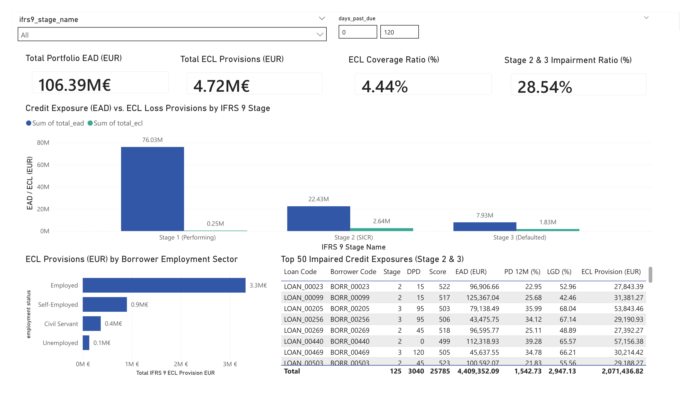
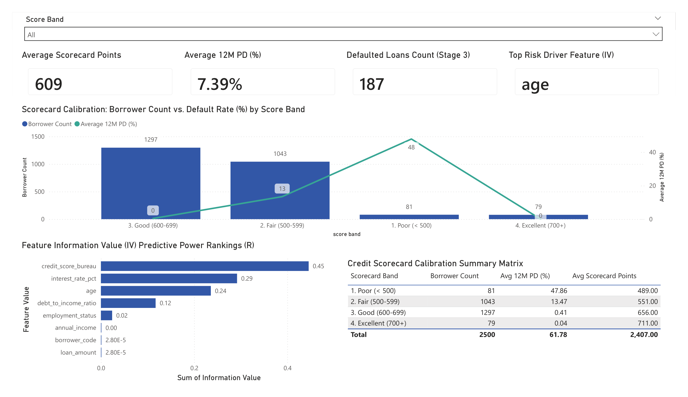

### Beschreibung

# IFRS 9 Credit Risk Scorecard & Expected Credit Loss (ECL) Engine

---

> 🇩🇪 **[Zur deutschen Version springen](#-deutsch-projektübersicht)** | 🇬🇧 **[Jump to English Version](#-english-project-overview)**

---

## 🇩🇪 Deutsch: Projektübersicht

Ein integriertes **Kreditrisiko- und IFRS 9 Impairment-System** für Banken und Finanzdienstleister. Das System führt **Weight of Evidence (WoE)** Binning und **Information Value (IV)** Feature Selection in **R** durch, trainiert **Probability of Default (PD)** Modelle (Logistische Regression & XGBoost, $\text{Gini} = 0.7467$, $\text{KS} = 64.56\%$) in **Python**, berechnet **IFRS 9 3-Stufen Expected Credit Losses ($\text{ECL} = \text{PD} \times \text{LGD} \times \text{EAD}$)** und generiert automatisiert prüfungsfähige **Excel-Finanzmodelle** sowie interaktive **Power BI Dashboards**.

### Hauptmerkmale

* **R Scorecard Feature Engineering**: Optimales monotones WoE-Binning und Information Value (IV) Ranking zur Identifikation der stärksten Risikotreiber (`credit_score_bureau`, `debt_to_income_ratio`).
* **Python PD Modellierung**: Aufbau und Benchmark-Vergleich von regulatorischer Logistischer Regression ($\text{AUC} = 0.8733$) und XGBoost ($\text{AUC} = 0.8582$). Transformation von Ausfallwahrscheinlichkeiten in Standard-Credit-Scorecard-Punkte ($300 - 850$).
* **IFRS 9 3-Stufen ECL-Berechnung**:
  * **Stufe 1 (Performing)**: 12-Monats-ECL für unauffällige Kredite.
  * **Stufe 2 (SICR)**: Lifetime-ECL bei signifikanter Verschlechterung der Kreditqualität ($\text{DPD} \ge 30$).
  * **Stufe 3 (Defaulted)**: Vollständige Lifetime-ECL für ausgefallene Kredite ($\text{DPD} \ge 90$).
* **Automatisiertes Excel-Finanzmodell**: Generierung prüfungsfähiger Excel-Arbeitsmappen (`reports/ifrs9_ecl_summary_model.xlsx`) mittels `openpyxl` mit formatierten Staging-Tabellen und Einzelwertberichtigungen.
* **SQL Reporting Layer & Power BI Dashboard**: PostgreSQL Reporting Views und ein 2-seitiges Power BI Dashboard zur visuellen Überwachung von Portfolio-Risikokennzahlen, Risikovorsorge und Scorecard-Kalibrierungen.

---

## 🇬🇧 English: Project Overview

### Description

An integrated **Credit Risk Scorecard and IFRS 9 Impairment Engine** built for banking and financial risk management. The system executes **Weight of Evidence (WoE)** binning and **Information Value (IV)** feature selection in **R**, trains **Probability of Default (PD)** models (Logistic Regression & XGBoost, $\text{Gini} = 0.7467$, $\text{KS} = 64.56\%$) in **Python**, computes **IFRS 9 3-Stage Expected Credit Losses ($\text{ECL} = \text{PD} \times \text{LGD} \times \text{EAD}$)**, and automatically generates auditable **Excel financial models** and interactive **Power BI Dashboards**.

### Key Features

* **R Scorecard Feature Engineering**: Optimal monotonic WoE binning and Information Value (IV) ranking identifying top risk drivers (`credit_score_bureau`, `debt_to_income_ratio`).
* **Python PD Modeling**: Calibration and benchmarking of regulatory Logistic Regression ($\text{AUC} = 0.8733$) against XGBoost ($\text{AUC} = 0.8582$). Scaling PD probabilities into standard credit scorecard points ($300 - 850$).
* **IFRS 9 3-Stage ECL Engine**:
  * **Stage 1 (Performing)**: 12-Month ECL for performing loans.
  * **Stage 2 (SICR)**: Lifetime ECL for loans with Significant Increase in Credit Risk ($\text{DPD} \ge 30$).
  * **Stage 3 (Defaulted)**: Full Lifetime ECL for credit-impaired loans ($\text{DPD} \ge 90$).
* **Automated Excel Financial Model**: Openpyxl-based pipeline exporting corporate-formatted Excel workbooks (`reports/ifrs9_ecl_summary_model.xlsx`) with staging summaries and top impaired exposures.
* **SQL Reporting Layer & Power BI Dashboard**: PostgreSQL reporting views and a 2-page Power BI dashboard monitoring portfolio ECL provisions, coverage ratios, and scorecard calibration curves.

---

## 📐 Mathematical & Econometric Formulations

$$
\text{WoE}_i = \ln \left( \frac{\% \text{ Non-Defaults}_i}{\% \text{ Defaults}_i} \right)
$$

$$
\text{IV} = \sum_{i=1}^k \left( \% \text{ Non-Defaults}_i - \% \text{ Defaults}_i \right) \times \text{WoE}_i
$$

$$
\text{ECL}_{\text{Loan}} = \text{PD}_{\text{Stage}} \times \text{LGD} \times \text{EAD}
$$

$$
\text{Gini Coefficient} = 2 \times \text{AUC} - 1 = 0.7467
$$

---

## 📊 Power BI Dashboard Previews

### Page 1: Executive IFRS 9 Portfolio Impairment Overview

### Page 2: Credit Scorecard Analytics & Feature Predictive Power (IV)

---

## 🛠️ Technology Stack

* **Database**: PostgreSQL 16 (Star Schema, Foreign Keys, SQL Views)
* **Statistical Feature Engineering**: R 4.3 (`scorecard`, `DBI`, `RPostgres`, `dplyr`)
* **Machine Learning & PD Modeling**: Python 3.11 (`scikit-learn`, `xgboost`, `scipy`, `SQLAlchemy`)
* **Financial Modeling**: Microsoft Excel (`openpyxl` automated formatting)
* **Business Intelligence**: Power BI Desktop (DAX Measures, Staging Heatmaps)
